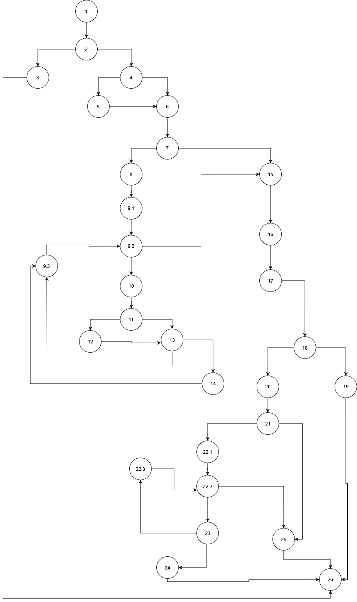

# Marko Nedelkovski, 213280

## Control flow graph



#### Cyclomatic complexity - 11
##### Calculated by the number of regions in the graph


### Test Cases:
#### Every branch

| C1(Every Branch) | user = null allUsers=any | User = User(username = null, password = hardPassword, email = test@gmail.com  AllUsers = ((username=user123, password = testPassword, email = test@gmail.com),(username = admin123, password = any, email = random@mail)) | User = User(username = user123,  password = test$User, email = user@gmail.com), allUsers = ((username = user123, password = passTest, email = any | User = User(username = user123, password = test test, email = test-email), AllUsers(any) | User = User(username = user123, password = test12345, email = test-email), AllUsers(any) |
|:-----------------|--------------------------|---------------------------------------------------------------------------------------------------------------------------------------------------------------------------------------------------------------------------|---------------------------------------------------------------------------------------------------------------------------------------------------|------------------------------------------------------------------------------------------|------------------------------------------------------------------------------------------|
| 1-2              | *                        | *                                                                                                                                                                                                                         | *                                                                                                                                                 | *                                                                                        | *                                                                                        |
| 2-3              | *                        |                                                                                                                                                                                                                           |                                                                                                                                                   |                                                                                          |                                                                                          |
| 2-4              |                          | *                                                                                                                                                                                                                         | *                                                                                                                                                 | *                                                                                        | *                                                                                        | 
| 3-26             | *                        |                                                                                                                                                                                                                           |                                                                                                                                                   |                                                                                          |                                                                                          |
| 4-5              |                          | *                                                                                                                                                                                                                         |                                                                                                                                                   |                                                                                          |                                                                                          |
| 4-6              |                          |                                                                                                                                                                                                                           | *                                                                                                                                                 | *                                                                                        | *                                                                                        |
| 5-6              |                          | *                                                                                                                                                                                                                         |                                                                                                                                                   |                                                                                          |                                                                                          |
| 6-7              |                          | *                                                                                                                                                                                                                         | *                                                                                                                                                 | *                                                                                        | *                                                                                        |
| 7-8              |                          | *                                                                                                                                                                                                                         | *                                                                                                                                                 |                                                                                          |                                                                                          |
| 7-15             |                          |                                                                                                                                                                                                                           |                                                                                                                                                   | *                                                                                        | *                                                                                        |
| 8-9.1            |                          | *                                                                                                                                                                                                                         | *                                                                                                                                                 |                                                                                          |                                                                                          | 
| 9.1-9.2          | *                        | *                                                                                                                                                                                                                         |                                                                                                                                                   |                                                                                          |                                                                                          | 
| 9.2-10           |                          | *                                                                                                                                                                                                                         | *                                                                                                                                                 |                                                                                          |                                                                                          | 
| 9.2-15           |                          | *                                                                                                                                                                                                                         | *                                                                                                                                                 |                                                                                          |                                                                                          |
| 10-11            |                          | *                                                                                                                                                                                                                         | *                                                                                                                                                 |                                                                                          |                                                                                          |
| 11-12            |                          | *                                                                                                                                                                                                                         |                                                                                                                                                   |                                                                                          |                                                                                          |
| 11-13            |                          | *                                                                                                                                                                                                                         | *                                                                                                                                                 |                                                                                          |                                                                                          |
| 12-13            |                          | *                                                                                                                                                                                                                         |                                                                                                                                                   |                                                                                          |                                                                                          |
| 13-14            |                          |                                                                                                                                                                                                                           | *                                                                                                                                                 |                                                                                          |                                                                                          |
| 13-9.3           |                          | *                                                                                                                                                                                                                         |                                                                                                                                                   |                                                                                          |                                                                                          |
| 14-9.3           |                          |                                                                                                                                                                                                                           | *                                                                                                                                                 |                                                                                          |                                                                                          |
| 9.3-9.2          |                          | *                                                                                                                                                                                                                         | *                                                                                                                                                 |                                                                                          |                                                                                          |
| 15-16            |                          | *                                                                                                                                                                                                                         | *                                                                                                                                                 | *                                                                                        | *                                                                                        | 
| 16-17            |                          | *                                                                                                                                                                                                                         | *                                                                                                                                                 | *                                                                                        | *                                                                                        |
| 17-18            |                          | *                                                                                                                                                                                                                         | *                                                                                                                                                 | *                                                                                        | *                                                                                        |
| 18-20            |                          |                                                                                                                                                                                                                           | *                                                                                                                                                 | *                                                                                        | *                                                                                        |
| 18-19            |                          | *                                                                                                                                                                                                                         |                                                                                                                                                   |                                                                                          |                                                                                          |
| 19-26            |                          | *                                                                                                                                                                                                                         |                                                                                                                                                   |                                                                                          |                                                                                          |
| 20-21            |                          |                                                                                                                                                                                                                           | *                                                                                                                                                 | *                                                                                        | *                                                                                        |
| 21-22.1          |                          |                                                                                                                                                                                                                           | *                                                                                                                                                 |                                                                                          | *                                                                                        |
| 21-25            |                          |                                                                                                                                                                                                                           | *                                                                                                                                                 |                                                                                          |                                                                                          |
| 22.1-22.2        |                          |                                                                                                                                                                                                                           | *                                                                                                                                                 |                                                                                          | *                                                                                        |
| 22.2-23          |                          |                                                                                                                                                                                                                           | *                                                                                                                                                 |                                                                                          | *                                                                                        |
| 22.2-25          |                          |                                                                                                                                                                                                                           |                                                                                                                                                   |                                                                                          | *                                                                                        |
| 23-24            |                          |                                                                                                                                                                                                                           | *                                                                                                                                                 |                                                                                          |                                                                                          |
| 23-22.3          |                          |                                                                                                                                                                                                                           | *                                                                                                                                                 |                                                                                          | *                                                                                        |
| 22.3-22.2        |                          |                                                                                                                                                                                                                           | *                                                                                                                                                 |                                                                                          | *                                                                                        |
| 24-26            |                          |                                                                                                                                                                                                                           | *                                                                                                                                                 |                                                                                          |                                                                                          |
| 25-26            |                          |                                                                                                                                                                                                                           |                                                                                                                                                   | *                                                                                        | *                                                                                        |


### Explanation of the test cases:
1. Is required to cover the exception.
2. Is required to cover the 4-5(if condition) and go through most of the branches in the first for loop.
3. Is required to pass the first for loop, check if the 2 usernames are identical
4. The last 2 cases are required for checking the password validity in the branches 18-19 and 20 through 25

### Test cases
#### Multiple conditions


| Test                                                                                            | user == null | user.getPassword() == null | user.getEmail()==null |
|-------------------------------------------------------------------------------------------------|--------------|----------------------------|-----------------------|
| User = null, allUsers = any                                                                     | T            | X                          | X                     |
| User = User(username = user123, password = null, email = any) allUsers = any                    | F            | T                          | X                     |
| User = User(username = user123, password = hardPassword, email = null) allUsers = any           | F            | F                          | T                     |
| User = User(username = user123, password = hardPassword, email = test@gmail.com) allUsers = any | F            | F                          | F                     |


###
#### Test Case 1: (User = null, allUsers = any)
##### - When the first argument in the if condition is **true** the whole conditions will be true
###

#### Test Case 2: (User = User(username = user123, password = null, email = any), allUsers = any)
##### - When the first argument in the if condition is **false** but the second argument is **true**
###

#### Test Case 3: (User = User(username = user123, password = hardPassword, email = null), allUsers = any)
##### - When the first and second arguments are **false** but the last one is **true**
###

#### Test Case 4: (User = User(username = user123, password = hardPassword, email = test@gmail.com), allUsers = any)
##### - When all the arguments are false
###


### UNIT TESTS:

#### Every branch pass:

```java
@Test
public void everyBranchTest(){


    assertAll(
        //Test case 1: user == null, allUsers = any
        () -> assertThrows(RuntimeException.class, () -> SILab2.function(null, Arrays.asList(new User("user123", "testPassword", "testEmail")))),

        //Test case 2: user1 username gets set to user1 email so that it also covers the branches condition in lines 4-5, 11-12
        () -> {
            User user1 = new User(null, "hardPassword", "test@gmail.com");
            List<User> allUsers1 = new ArrayList<>();
            allUsers1.add(new User("user123", "testPassword", "test@gmail.com"));
            allUsers1.add(new User("admin123", "any", "random@mail"));
            SILab2.function(user1, allUsers1);
            assertEquals("test@gmail.com", user1.getUsername());
        },

        //Test case 3: user2 and allUsers2 have the same username to cover branches 13-14, and the user2 password is valid to cover lines 20 through 24
        () -> {
            User user2 = new User("user123", "test$User", "user@gmail.com");
            List<User> allUsers2 = Arrays.asList(
                new User("user123", "passTest", "any")
            );
            boolean result2 = SILab2.function(user2, allUsers2);
            assertFalse(result2);
        },

        //Test case 4: user3 has invalid password to cover branch 21-25
        () -> {
            User user3 = new User("user123", "test test", "test-email");
            List<User> allUsers3 = Arrays.asList(
                new User("user123", "passTest", "any")
            );
            boolean result3 = SILab2.function(user3, allUsers3);
            assertFalse(result3);
        },
        //Test case 5: user4 has invalid email to cover branch 7-15
        () -> {
            User user4 = new User("user123", "test12345", "test-email");
            List<User> allUser4 = Arrays.asList(
                new User("user123", "passTest", "any")
            );
            boolean result4 = SILab2.function(user4, allUser4);
            assertFalse(result4);
        }
    );
)
```

#### Multiple conditions pass:
```java
@Test
public void multipleConditionsTest(){

        assertAll(
            //Test case 1: covers arguments in the condition (True, any, any)
            () -> assertThrows(RuntimeException.class, () -> SILab2.function(null, Arrays.asList(new User("user123", "test", "testEmail")))),
            //Test case 2: covers arguments in the condition (False, True, any)
            () -> assertThrows(RuntimeException.class, () -> SILab2.function(new User("user123", null, "test"), Arrays.asList(new User("user123", "test", "testEmail")))),
            //Test case 3: covers arguments in the condition (False, False, True)
            () -> assertThrows(RuntimeException.class, () -> SILab2.function(new User("user123", "hardPassword", null), Arrays.asList(new User("user123", "test", "testEmail")))),
            //Test case 4: covers arguments in the condition (False, False, False)
            () -> {
                User user = new User("user123", "hardPassword", "test@gmail.com");
                boolean result = SILab2.function(user, Arrays.asList(new User("user123", "test", "testEmail")));
                assertFalse(result);
            }
        );
}
```